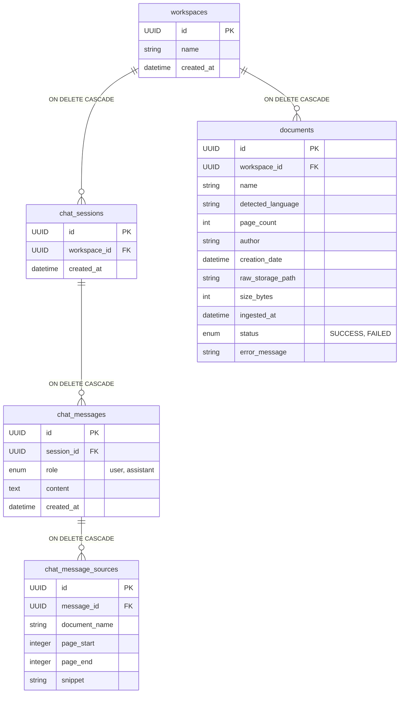
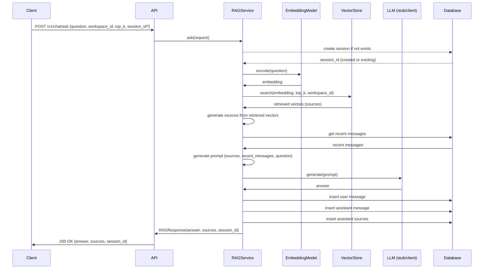

# Архитектура Ingestion Service

## Архитектурные слои

### **`api` (Слой API)**
- **Ответственность**:
  - Приём HTTP-запросов
  - Валидация входа
  - Сериализация ответов
  - Настройка маршрутов
  - События приложения (например, startup/shutdown).
  - Внедрение зависимостей (FastAPI dependencies)
  - Регистрация обработчиков ошибок.
- **Ключевые модули**:
  - `api/main.py`: создание FastAPI клиента, точки монтирования роутеров и обработчиков (ошибок, событий).
  - `api/events.py`: обработчики событий, инициализация глобальных ресурсов (app.state).
  - `api/exc_handlers.py`: перевод доменных ошибок в HTTP-ответы.
  - `api/v1/*.py`: роутеры/эндпоинты, зависимости.
- **Особенности**:
  - Не содержит бизнес-логики - вызывает сервисы из `domain`.
  - Использует фоновые задачи для долгих (тяжелых) операций (загрузка/обработка документов).
  - В app.state находятся глобальные ресурсы (например, `RawStorage`, `VectorStore`, ...).

### **`config` (Конфигурация и логирование)**
- **Ответственность**:
  - Загрузка конфигурации из окружения/файлов (Pydantic `BaseSettings`).
  - Настройка логгера (структурированное логирование).
- **Ключевые модули**:
  - `config/settings.py`: конфигурации (`MinIO`, `PostgreSQL`, `SentenceTransformer`, `TextSplitter` и т.п.)
  - `config/logging.py`: настройка logger (структурированные сообщения, логирование в файл).

### **`domain` (Слой бизнес-логики)**
- **Ответственность**:
  - Вся бизнес-логика и модели предметной области (DAO, DTO, схемы), репозитории, сервисы.
- **Ключевые пакеты**:
  - `domain/chat`: RAG-логика, управление сессиями, сообщениями.
  - `domain/database`: общая бд-логика (подключения, миксины (Mixins), модели, репозитории, UoW).
  - `domain/document`: обработка документов.
  - `domain/extraction`: экстракторы текста (PDF, DOCX, ...)
  - `domain/workspace`: работа с рабочими пространствами.
  - `domain/embedding`: работа с эмбеддингами, векторами.
  - `domain/text_splitter`: разделители страниц, текста на чанки (фрагменты).
- **Ключевые правила**:
  - Изолирован от инфраструктуры: все зависимости (хранилище, векторный индекс, репозитории) принимаются через интерфейсы/протоколы.
  - Преобразование ORM <-> DTO выполняется через Pydantic `from_attributes`/`model_validate`.

### **`exceptions` (Исключения)**
- **Ответственность**:
  - Доменные исключения и их иерархия.
  - Используются в сервисах, переводятся в HTTP-ошибки на уровне `api/exc_handlers.py`.
- **Ключевые модули**:
  - `exceptions/base.py`: базовые исключения.

### **`infrastructure` (Инфраструктура)**
- **Ответственность**:
  - Реальные реализации контрактов `services/interfaces.py`, например `MinIORawStorage`, `QdrantVectorStore` и т.п.
- **Ключевые модули**:
  - `infrastructure/storage_minio.py`: реализация интерфейса `RawStorage` на базе MinIO файлового хранилища.
  - `infrastructure/vectorstore_qdrant.py`: реализация интерфейса `VectorStore` на базе Qdrant векторного хранилища.

### **`schemas` (Схемы / DTO)**
- **Ответственность**:
  - Определение `Pydantic`-моделей для DTO (Data Transfer Objects) и общих схем данных.
  - Унификация контрактов данных между слоями.
  - Упрощение преобразования ORM-моделей в DTO через `from_attributes`.
  - Предоставление "сырого" дампа данных (`model_raw_dump`), минуя сериализацию `Pydantic`.
- **Ключевые модули**:
  - `schemas/base.py`: базовые классы `BaseSchema` и `BaseDTO` с общими настройками конфигурации Pydantic.
  - `schemas/mixins.py`: набор mixin-классов (`UUIDMixin`, `CreatedAtMixin`, `UpdatedAtMixin`, `TimestampMixin`), добавляющих общие поля (идентификаторы, временные метки).

### **`services` (Абстракции / Интерфейсы)**
- **Ответственность**:
  - Описание `Protocol`-интерфейсов для хранения (`RawStorage`, `VectorStore`, `Repository`) и других внешних сервисов.
  - Используются в `domain` для типизации и DI.
- **Ключевые модули**:
  - `services/interfaces.py`: интерфейсы.

### **`stubs` (Заглушки для локальной разработки и тестирования)**
- **Ответственность**
  - Лёгкие, файл-системные реализации интерфейсов для разработки: `FileRawStorage`, `JSONVectorStore`.
  - Используются в on_startup событии при отсутствии production конфигурации (например, `settings.minio`).
- **Ключевые модули**:
  - `stubs/raw_storage.py`: заглушка хранилища сырых файлов.
  - `stubs/vector_store.py`: заглушка векторного хранилища.
  - `stubs/llm_stub.py`: LLM заглушка.

### **`utils` (Утилиты)**
- **Ответственность**
  - Реализация общих утилит, например получение универсального времени без временной зоны.
  - Используются во всем приложении.
- **Ключевые модули**:
  - `utils/datetime.py`: утилиты для конвертирования времени из строки в datetime и обратно и т.п.
  - `utils/file.py`: утилиты для работы с файлами: определение MIME-типа, расширения файла.
  - `utils/singleton.py`: реестр синглтонов.

## Технологии

### API / Web
- `FastAPI`
  - **Роль**: основной web/HTTP фреймворк (ASGI) — маршрутизация, валидация входных данных, OpenAPI, инъекции зависимостей.
  - **Почему выбран**: быстрый разработческий цикл, асинхронная архитектура, богатый встроенный функционал (docs, DI).
  - **Альтернативы**:
    - `Flask`: синхронный
    - `Django REST Framework`: более монолитное решение
  - **Примечания**:
    - Запуск под ASGI (`Uvicorn` / `Gunicorn`).
    - На продакшене рекомендуется `Gunicorn` + `Uvicorn workers` (`uvloop`).
- `Uvicorn`
  - **Роль**: ASGI сервер приложения.
- `Gunicorn`
  - **Роль**: менеджер процессов для продакшн-развёртывания.
- `python-multipart`:
  - **Роль**: прием `multipart/form-data` (файловые загрузки) в `FastAPI`.
  - **Примечания**:
    - Загрузки больших файлов нагружают память/диск.

### Application / Services / Background
- `FastAPI BackgroundTasks`
  - **Роль**: в текущей реализации используется для неблокирующего запуска задач обработки документов.
  - **Примечания**:
    - Удобно для прототипа.
    - При росте нагрузки стоит переносить обработку в очередь задач (`Celery` / `RQ` / `Kafka + workers`).

### Database / Persistence
- `SQLAlchemy (async)` + `asyncpg`
  - **Роль**: ORM (SQLAlchemy 2.0 async API) и асинхронный драйвер для PostgreSQL.
  - **Почему выбран**:
    - Мощный ORM с гибкими возможностями маппинга
    - `asyncpg` - высокопроизводительный асинхронный драйвер.
  - **Альтернативы**:
    - Сырые запросы без ORM с `asyncpg`
    - `Django ORM`: синхронный
    - `Tortoise ORM`
- `Alembic`
  - **Роль**: управление миграциями баз данных, версионирование схем.
  - **Примечания**:
    - Держать миграции в VCS.
    - Применять миграции в CI/CD пайплайне перед деплоем.

### Raw file storage
- `MinIO` (client: `minio`)
  - **Роль**: S3-совместимое хранилище для сырых загруженных файлов.
  - **Почему выбран**:
    - S3 API-совместимость
    - Легко разворачивается локально
    - Переносимо на S3.
  - **Альтернативы**:
    - `cloud.ru`
    - `Google Cloud Storage`
    - `AWS S3`
    - `Azure Blob Storage`
- `FileRawStorage` (stub)
  - **Роль**: локальная файловая реализация для разработки и тестов.
  - **Примечания**:
    - Не используйте в продакшене.

### Document processing / extraction / conversion
- `pypdf`
  - **Роль**: извлечение страниц/текста и метаданных из PDF.
  - **Альтернативы**:
    - `PyPDF2`, `PyPDF3`, `PyPDF4`
    - `pdfplumber`
  - **Примечания**:
    - Сложные PDF (с изображениями) потребуют OCR — это вне текущей реализации.
- `python-docx`
  - **Роль**: извлечение текста и метаданных из DOCX.
- `mammoth` + `weasyprint`
  - **Роль**: используется как способ получить согласованные страница/текст из DOCX.
    - `mammoth`: конвертирует DOCX в HTML.
    - `weasyprint`: конвертирует HTML в DOCX.
  - **Альтернативы**: требуют множества тяжелых зависимостей или являются коммерческими проектами.
  - **Примечания**:
    - Не может идеально точно конвертировать постранично.
    - Системная зависимость от библиотек Pango и Cairo; требуется при развёртывании.
- `python-magic`
  - **Роль**: определение MIME-типа по байтам (magic detection) - безопаснее, чем опираться только на расширение.
  - **Примечания**:
    - Системная зависимость от libmagic; требуется при развёртывании.

### Text splitting / NLP utilities
- `langchain` (только `TextSplitter` в текущем коде)
  - **Роль**: вспомогательные утилиты для разбиения текста на чанки.
  - **Альтернативы**: реализовать кастомный сплиттер; использовать токенизацию от языковых моделей.
- `langdetect`
  - **Роль**: определение языка документа по текстовому образцу.
  - **Примечания**:
    - Модель статистическая - может иногда ошибаться, предусмотреть fallback.

### Vector embeddings / ML
- `sentence-transformers`
  - **Роль**: получение эмбеддингов для документов/вопросов.
  - **Почему выбран**:
    - Простая интеграция.
    - Локальное исполнение моделей.
    - Гибкость.
  - **Альтернативы**;
    - Внешние сервисы (например, OpenAI)
    - Удаленный эмбеддинг микросервис.
- `JSONVectorStore` (stub)
  - **Роль**: локальная файловая реализация индексов для разработки и тестов.
  - **Рекомендации**:
    - В продакшене поменять на Qdrant, Pinecone или др.

### Serialization / Validation / DTOs
- `pydantic`
  - **Роль**: схемы/DTO, валидация.
  - **Примечания**:
    - `ConfigDict(from_attributes=True)` для удобной интеграции ORM -> DTO (`model_validate`/`from_attributes`).
- `pydantic-settings`
  - **Роль**: настройки переменных окружения.

### Logging / Observability
- `loguru`
  - **Роль**: структурированное логирование, удобный API для логов.
  - **Примечания**:
    - Интегрировать с сервисами для сбора, хранения, обработки и анализа логов.
    - (Дополнительно) при развитии проекта добавить метрики (например, Prometheus + OpenTelemetry).

Точные версии зависимостей закреплены в pyproject.toml. Обратитесь к этому файлу для получения точных версий.

## ER-диаграмма таблиц


## Схема работы чат-сессий


## Как добавить "продуктивные" реализации

**Пример: Добавление поддержки S3 для `RawStorage`**

1. **Создать новую реализацию:**
- Создать файл, например, `./infrastructure/s3_storage.py`.
- В этом файле создать класс `S3RawStorage`, который реализует протокол `RawStorage` (т.е. имеет методы интерфейса `RawStorage`).

```python
from services import RawStorage

class S3RawStorage(RawStorage):
   def __init__(self, bucket_name: str):
      self.s3_client = ...
      self.bucket_name = bucket_name

   def save(self, file_bytes: bytes, path: str) -> None:
      self.s3_client.put(
         bucket=self.bucket_name, 
         key=path, 
         data=file_bytes,
      )

     # ...
     # другие методы
```

2. **Обновить конфигурацию:**
- Добавить в `config/settings.py` класс, наследованный от `BaseSettings`, необходимый для новой реализации (например, `S3Settings(BaseSettings)`).
- Добавить в новую реализацию конфига переменные для подключения к хранилищу (например, `s3_bucket`).
```python
class S3Settings(BaseSettings):
    s3_bucket: Annotated[str | None, Field(alias="S3_BUCKET")] = None
```

- Добавить инициализацию конфига в `config/__init__.py`
```python
from config.settings import (
    APISettings as _APISettings,
    # ...
    S3Settings as _S3Settings,
)

class Settings:
    api = _APISettings()
    # ...
    s3 = _S3Settings()
```

3. **Обновить `api/events.py`:**
- Добавить логику в `on_startup_event_handler(app: "FastAPI")`, чтобы функция устанавливала зависимость raw_storage, если `settings.s3_bucket` установлен.

```python
from typing import Coroutine
from config import settings
from stubs import FileRawStorage
from infrastructure.s3_storage import S3RawStorage # Импортируем новый класс

async def on_startup_event_handler(app: "FastAPI") -> None:
    def __init_object(cls, *args, **kwargs) -> Coroutine:
        ...
  
    if settings.minio.is_configured:
        ...
    elif settings.s3.s3_bucket:
        raw_storage_coro = __init_object(
            S3RawStorage,
            # любые другие keyword аргументы, если есть в конфиге
            bucket_name=settings.s3.s3_bucket,
        )
    else:
        raw_storage_coro = __init_object(FileRawStorage)

    tasks: list[Coroutine] = [
        raw_storage_coro,
        # ...
    ]
```

Теперь, просто изменив переменную окружения `S3_BUCKET=bucket_name`, все приложение начнет использовать 
S3 вместо локального хранилища, без единого изменения в `domain/` или `api/` слоях, за исключением 
самих синглтонов в `api/events.py`.

**Пример: Добавление поддержки новых документов для `TextExtractor`**

1. **Создать новую реализацию:**
- Создать новый класс в `domain/extraction/base.py`, например, `XlsxExtractor`.
- Этот класс будет использовать библиотеку `openpyxl` для взаимодействия с XLSX документами.
- В этом классе реализовать метод `_extract(...)`

```python
from domain.extraction.schemas import (
    Page,
    ExtractedInfo,
)

class XlsxExtractor(TextExtractor):
    def _extract(self, document: IO[bytes]) -> ExtractedInfo:
        document = openpyxl.load_workbook(document)
        metadata = document.properties
        pages: list[Page] = ... # текст, разбитый постранично

        return ExtractedInfo(
            pages=pages,
            document_page_count=len(pages),
            author=metadata.creator,
            creation_date=metadata.created,
        )
```
   
2. **Обновить фабрику экстракторов `domain/extraction/factory.py`:**
- Добавить в `ExtractorFactory._map` новый экстрактор, необходимый для обработки документов данного типа, чтобы функция `ExtractorFactory.get_extractor(...)` возвращала его, когда потребуется.

```python
from domain.extraction.base import (
    TextExtractor,
    PdfExtractor,
    # ...
    XlsxExtractor,
)

class ExtractorFactory:
    _map: dict[str, type[TextExtractor]] = {
        "pdf": PdfExtractor,
        # ...
        "xlsx": XlsxExtractor,
    }
```
   
Теперь из документов типа XLSX тоже можно будет извлечь текст и необходимые метаданные.
