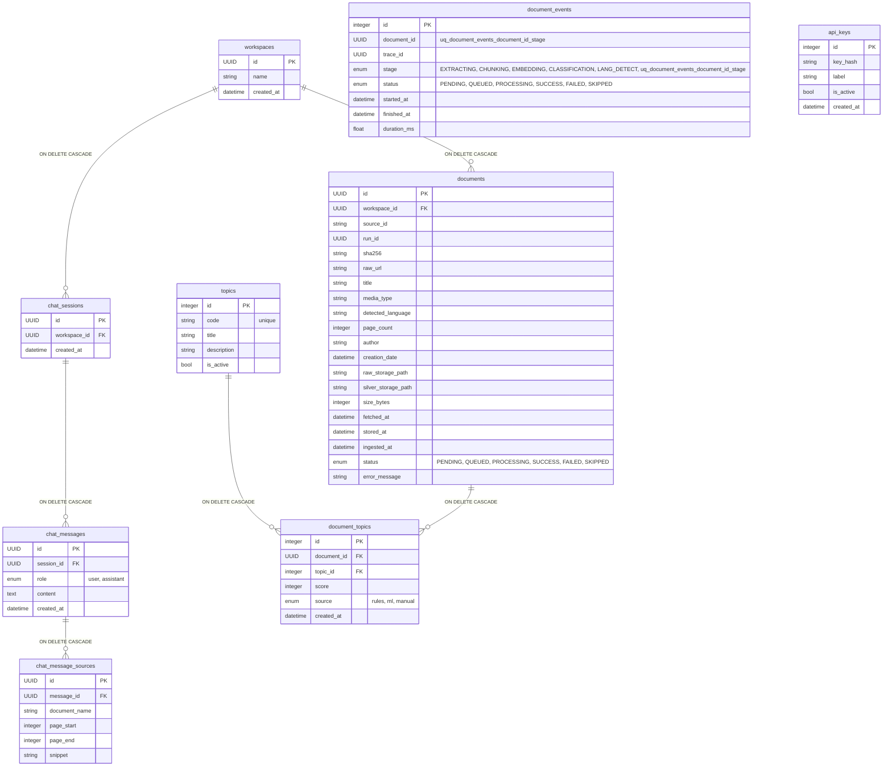
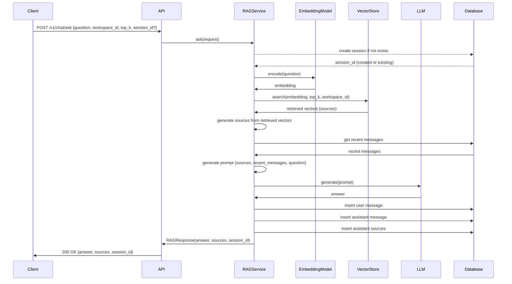

# Архитектура Ingestion Service

## Архитектурные слои

### **`app/core` (Конфигурация и логирование)**
- **Ответственность**:
  - Загрузка конфигурации из окружения/файлов (Pydantic `BaseSettings`).
  - Настройка логгера (структурированное логирование).
- **Ключевые модули**:
  - `config.py`: Конфигурации (`PostgreSQL`, `SentenceTransformer`, `TextSplitter` и т.п.)
  - `logging.py`: Настройка логгера (структурированные сообщения, логирование в файл).
- **Особенности**:
  - Настройки компонентов, например `APISettings`, `CelerySettings` и др. не парсятся из ENV при импорте модуля. Используется @cached_property, и пока настройки не потребуются (вызов settings.api), они не будут инициализированы.
  - В модуле логгера есть перехватчик логов различных библиотек, есть возможность их отключить или отправить в другой канал.

### **`app/domain` (Бизнес-логика)**
- **Ответственность**:
  - Вся бизнес-логика и модели предметной области (DAO, DTO, схемы), репозитории, сервисы.
- **Ключевые пакеты**:
  - `chat`: RAG-логика, управление сессиями, сообщениями.
  - `classifier`: Классификатор тем
  - `database`: Общая бд-логика (подключения, миксины (Mixins), модели).
  - `document`: Обработка документов.
  - `embedding`: Работа с эмбеддингами, векторами.
  - `extraction`: Экстракторы текста (PDF, DOCX, ...)
  - `security`: Безопасность, API-ключи, аутентификация/авторизация, Keycloak.
  - `text_splitter`: Разделители страниц, текста на чанки (фрагменты).
  - `workspace`: Работа с рабочими пространствами.
- **Ключевые правила**:
  - Изолирован от инфраструктуры: все зависимости (хранилище, векторный индекс) принимаются через интерфейсы/протоколы.
  - Преобразование ORM <-> DTO выполняется через Pydantic `from_attributes`/`model_validate`.

### **`app/exceptions` (Исключения)**
- **Ответственность**:
  - Доменные исключения и их иерархия.
  - Используются в сервисах, переводятся в HTTP-ошибки на уровне `api/exc_handlers.py`.
- **Ключевые модули**:
  - `base.py`: базовые исключения.

### **`app/infrastructure` (Инфраструктура)**
- **Ответственность**:
  - Реальные реализации контрактов `services/interfaces.py`, например `MinIORawStorage`, `QdrantVectorStore` и т.п.
- **Ключевые модули**:
  - `llm_client_ollama.py`: Реализация интерфейса `LLMClient` на базе Ollama.
  - `repository_sqlalchemy.py`: Реализация интерфейса `Repository` на базе БД.
  - `storage_minio.py`: Реализация интерфейса `RawStorage` на базе MinIO файлового хранилища.
  - `vectorstore_qdrant.py`: Реализация интерфейса `VectorStore` на базе Qdrant векторного хранилища.

### **`app/interfaces` (Абстракции / Интерфейсы)**
- **Ответственность**:
  - Описание `Protocol`-интерфейсов для хранения (`RawStorage`, `VectorStore`, `Repository`) и других внешних сервисов.
  - Используются в `domain` для типизации и DI.
- **Ключевые модули**:
  - `llm_client.py`: Контракт `LLMClient` для работы с LLM (генерация ответа и др.).
  - `raw_storage.py`: Контракт `RawStorage` для работы с файловыми хранилищами (`MinIO`, `AWS S3` и др.).
  - `repository.py`: Контракт `Repository` для работы с часто востребованными данными (`PostgreSQL` и др. хранилища).
  - `vector_store.py`: Контракт `VectorStore` для работы с векторными хранилищами (`Qdrant`, `Pinecone` и др.)

### **`app/metrics` (Метрики / Инструменты для сбора метрик)**
- **Ответственность**:
  - Локальное хранение метрик - не в хранилище, просто в модуле.
  - Сбор метрик, если возможен.
  - Инструменты для сбора метрик.
- **Ключевые пакеты**:
  - `celery`: Celery метрики, оркестратор для сбора метрик.
    - **Особенности**:
      - Метрики собираются автоматически при запуске оркестратора.
      - Не требуется интеграция в коде, так как используется обмен данными с Celery.
  - `kafka`: Kafka метрики.
    - **Особенности**:
      - Не используется реестр метрик (`CollectorRegistry`), так как использование предполагается в режиме мультипроцесса.

### **`app/schemas` (Схемы / DTO)**
- **Ответственность**:
  - Определение `Pydantic`-моделей для DTO (Data Transfer Objects) и общих схем данных.
  - Унификация контрактов данных между слоями.
  - Упрощение преобразования ORM-моделей в DTO через `from_attributes`.
  - Предоставление "сырого" дампа данных (`model_raw_dump`), минуя сериализацию `Pydantic`.
- **Ключевые модули**:
  - `base.py`: базовые классы `BaseSchema` и `BaseDTO` с общими настройками конфигурации Pydantic.
  - `mixins.py`: набор mixin-классов (`UUIDMixin`, `CreatedAtMixin`, `UpdatedAtMixin`, `TimestampMixin`), добавляющих общие поля (идентификаторы, временные метки).

### **`app/stubs` (Заглушки для локальной разработки и тестирования)**
- **Ответственность**
  - Лёгкие, файл-системные реализации интерфейсов для разработки: `LLMClient`, `FileRawStorage`, `JSONVectorStore`.
  - Используются в `config/adapters.py` при отсутствии production конфигурации, например `MinIO`.
- **Ключевые модули**:
  - `llm_client.py`: LLM заглушка.
  - `raw_storage.py`: Заглушка для хранения исходных документов в локальном файловом хранилище.
  - `vector_store.py`: Заглушка для хранения векторов в локальном файловом хранилище.

### **`app/utils` (Утилиты)**
- **Ответственность**
  - Реализация общих утилит, например получение универсального времени без временной зоны.
  - Используются во всем приложении.
- **Ключевые модули**:
  - `datetime.py`: Утилиты для работы с datetime, сериализацией datetime, десериализацией (конвертирование из строки в datetime).
  - `file.py`: Утилиты для работы с файлами: определение MIME-типа, расширения файла.
    - **Особенности**:
      - Содержит переменную _types_map, в которой находится маппинг MIME -> EXTENSION. Библиотека mimetypes может содержать неполный набор MIME-типов в некоторых операционных системах.
      - Если требуются дополнительные анализаторы типов, можно дополнить _types_map своими.
  - `health.py`: Утилиты для получения состояния сервисов (Redis, Celery и др.).
  - `sequence.py`: Утилиты для работы с последовательностями. В данный момент содержит только функцию `chunked` для разбиения списка на чанки (несколько списков с определенным размером).
  - `singleton.py`: Реестр синглтонов.

###  **`app/workflows` (Рабочие процессы)**
- **Ответственность**:
  - Длинные пайплайны обработки
- **Ключевые модули**:
  - `document.py`: Пайплайн обработки документа.
    - **Особенности**:
      - Используется в Celery, другие сценарии не рекомендуются.

### **`services/api` (API)**
- **Ответственность**:
  - Приём HTTP-запросов
  - Валидация входа
  - Сериализация ответов
  - Настройка маршрутов
  - События приложения (например, startup/shutdown).
  - Внедрение зависимостей (FastAPI dependencies)
  - Регистрация обработчиков ошибок.
  - Инициализация приложения.
- **Ключевые пакеты**:
  - `routers`: Роутеры, эндпоинты, зависимости.
- **Ключевые модули**:
  - `events.py`: Обработчики событий, инициализация глобальных ресурсов (app.state).
  - `exc_handlers.py`: Перевод доменных ошибок в HTTP-ответы.
  - `main.py`: Инициализация FastAPI приложения, точка монтирования роутеров и обработчиков ошибок/событий.
  - `routes.py`: Промежуточная точка сбора роутеров с разных маршрутов, безопасность роутеров.
- **Особенности**:
  - Не содержит бизнес-логики - вызывает сервисы из `domain`.
  - Есть события on_startup и on_shutdown для обработки синхронизаций и т.п. случаев.

### **`services/celery_exporter` (Celery метрики)**
- **Ответственность**:
  - Инициализация и запуск сервера метрик.
- **Ключевые модули**:
  - `main.py`: Инициализация и запуск Exporter (оркестратор Celery метрик).

### **`services/celery_worker` (Celery worker / Celery задачи)**
- **Ответственность**:
  - Инициализация приложения.
  - Реализация пресериализаторов для интеграций с различными типами данных.
  - Выполнение тяжелых задач.
- **Ключевые пакеты**:
  - `tasks`: Задачи различных компонентов сервиса, например пайплайн обработки документа или синхронизация топиков с БД.
- **Ключевые модули**:
  - `main.py`: Инициализация Celery приложения, настройки планировщика задач.
  - `preserializers`: Пресериализаторы для поддержки интеграций различных типов с Celery. В данный момент реализована только поддержка Pydantic.

### **`services/kafka_consumer` (Kafka потребители)**
- **Ответственность**:
  - 
- **Ключевые пакеты**:
  - `consumers`: Обработчики сообщений.
- **Ключевые модули**:
  - `main.py`: Инициализация приложения и само приложение.
  - `worker.py`: Kafka Worker.

## Технологии

### API / Web
- `FastAPI`
  - **Роль**: Основной web/HTTP фреймворк (ASGI) - маршрутизация, валидация входных данных, OpenAPI, инъекции зависимостей.
  - **Почему выбран**: Быстрый разработческий цикл, асинхронная архитектура, богатый встроенный функционал (docs, DI).
  - **Альтернативы**:
    - `Flask`: Синхронный.
    - `Django REST Framework`: Более монолитное решение.
  - **Примечания**:
    - Запуск под ASGI (`Uvicorn` / `Gunicorn`).
    - На продакшене рекомендуется `Gunicorn` + `Uvicorn workers` (`uvloop`).
- `Uvicorn`
  - **Роль**: ASGI сервер приложения.
- `Gunicorn`
  - **Роль**: Менеджер процессов для продакшн-развёртывания.
- `python-multipart`:
  - **Роль**: Прием `multipart/form-data` (файловые загрузки) в `FastAPI`.
  - **Примечания**:
    - Загрузки больших файлов нагружают память/диск.

### Application / Services / Background
- `Celery`
  - **Роль**: Перенос нагрузки на API в очередь задач.
  - **Альтернативы**:
    - `FastAPI BackgroundTasks`: Легкий в использовании, но слабый функционал. API загружено, снижается производительность.

### Database / Persistence
- `SQLAlchemy (async)` + `asyncpg`
  - **Роль**: ORM (SQLAlchemy 2.0 async API) и асинхронный драйвер для PostgreSQL.
  - **Почему выбран**:
    - Мощный ORM с гибкими возможностями маппинга
    - `asyncpg` - высокопроизводительный асинхронный драйвер.
  - **Альтернативы**:
    - Сырые запросы без ORM с `asyncpg`
    - `Django ORM`: синхронный
    - `Tortoise ORM`
- `Alembic`
  - **Роль**: управление миграциями баз данных, версионирование схем.
  - **Примечания**:
    - Держать миграции в VCS.
    - Применять миграции в CI/CD пайплайне перед деплоем.

### File storage
- `MinIO` (client: `minio`)
  - **Роль**: S3-совместимое хранилище для сырых загруженных файлов.
  - **Почему выбран**:
    - S3 API-совместимость
    - Легко разворачивается локально
    - Переносимо на S3.
  - **Альтернативы**:
    - `cloud.ru`
    - `Google Cloud Storage`
    - `AWS S3`
    - `Azure Blob Storage`
- `LocalFileStorage` (stub)
  - **Роль**: локальная файловая реализация для разработки и тестов.
  - **Примечания**:
    - Не используйте в продакшене.

### Vector embeddings / ML
- `sentence-transformers`
  - **Роль**: Получение эмбеддингов для документов/вопросов.
  - **Почему выбран**:
    - Простая интеграция.
    - Локальное исполнение моделей.
    - Гибкость.
  - **Альтернативы**;
    - Внешние сервисы (например, OpenAI)
    - Удаленный эмбеддинг микросервис.
- `Qdrant` (client: `qdrant-client`)
  - **Роль**: Векторное хранилище, поиск схожих векторов.
  - **Почему выбран**:
    - Семантический поиск.
    - Обнаружение аномалий.
    - Продвинутый поиск по векторному сходству.
    - Гибкая фильтрация по метаданным.
    - Легко разворачивается локально.
- `JSONVectorStore` (stub)
  - **Роль**: Локальная файловая реализация индексов для разработки и тестов.
  - **Примечания**:
    - Не используйте в продакшене.

### LLM
- `Ollama` (client: `ollama`)
  - **Роль**: Локальный запуск LLM.
  - **Почему выбран**:
    - Локальное выполнение.
    - Простота использования.
    - Расширяемость.
- `StubLLMClient` (stub)
  - **Роль**: Локальная заглушка для разработки и тестов.
  - **Примечания**:
    - Не используйте в продакшене.

### Document processing / extraction / conversion
- `pypdf`
  - **Роль**: извлечение страниц/текста и метаданных из PDF.
  - **Альтернативы**:
    - `PyPDF2`, `PyPDF3`, `PyPDF4`
    - `pdfplumber`
  - **Примечания**:
    - Сложные PDF (с изображениями) потребуют OCR - это вне текущей реализации.
- `python-docx`
  - **Роль**: извлечение текста и метаданных из DOCX.
- `mammoth` + `weasyprint`
  - **Роль**: используется как способ получить согласованные страница/текст из DOCX.
    - `mammoth`: конвертирует DOCX в HTML.
    - `weasyprint`: конвертирует HTML в DOCX.
  - **Альтернативы**: требуют множества тяжелых зависимостей или являются коммерческими проектами.
  - **Примечания**:
    - Не может идеально точно конвертировать постранично.
    - Системная зависимость от библиотек Pango и Cairo; требуется при развёртывании.
- `python-magic`
  - **Роль**: определение MIME-типа по байтам (magic detection) - безопаснее, чем опираться только на расширение.
  - **Примечания**:
    - Системная зависимость от libmagic; требуется при развёртывании.

### Text splitting / NLP utilities
- `langchain` (только `TextSplitter` в текущем коде)
  - **Роль**: вспомогательные утилиты для разбиения текста на чанки.
  - **Альтернативы**: реализовать кастомный сплиттер; использовать токенизацию от языковых моделей.
- `langdetect`
  - **Роль**: определение языка документа по текстовому образцу.
  - **Примечания**:
    - Модель статистическая - может иногда ошибаться, предусмотреть fallback.

### Serialization / Validation / DTOs
- `pydantic`
  - **Роль**: схемы/DTO, валидация.
  - **Примечания**:
    - `ConfigDict(from_attributes=True)` для удобной интеграции ORM -> DTO (`model_validate`/`from_attributes`).
- `pydantic-settings`
  - **Роль**: настройки переменных окружения.

### Logging / Observability
- `loguru`
  - **Роль**: структурированное логирование, удобный API для логов.
  - **Примечания**:
    - Интегрировать с сервисами для сбора, хранения, обработки и анализа логов.
    - (Дополнительно) при развитии проекта добавить метрики (например, Prometheus + OpenTelemetry).

### Security / JWT
- `argon2` (client: `argon2-cffi`)
  - **Роль**: Хэширование API-ключей.
  - **Почему выбран**:
    - Гибкость настройки параметров (память, итерации, параллелизм) позволяет адаптировать алгоритм под конкретные нужды.
    - Устойчивость к атакам с использованием специализированного оборудования (GPU, ASIC, FPGA).
    - Современное решение.
  - **Альтернативы**:
    - `bcrypt`: Легкий для использования, но ограничение 72 байта, больше не безопасно.
- `pyjwt`
  - **Роль**: Работа с JWT-токенами.
  - **Почему выбран**:
    - Простота использования и интуитивный API
    - Широкий выбор алгоритмов шифрования
  - **Альтернативы**:
    - `authlib`
    - `python-jose`
    - `itsdangerous`

Точные версии зависимостей закреплены в pyproject.toml. Обратитесь к этому файлу для получения точных версий.

## ER-диаграмма таблиц


## Схема работы чат-сессий


## Конфигурации

### Qdrant - конфигурация коллекции (Архитектура)

- `Размерность` (vector size) - обязательна и должна совпадать с выходной размерностью модели эмбеддингов.
  - Примеры:
    - 384: all-MiniLM-L6-v2
    - 768: Многие из sentence-transformers
    - 1536: OpenAI text-embedding-3-small
- `Дистанция` (distance) - влияет на то, как Qdrant вычисляет близость векторов:
  - `Cosine`: Измеряет степень сонаправленности и длину векторов. Часто лучше для семантического поиска.
  - `Dot`: Скалярное произведение. Используется, когда длина вектора имеет значение, например, в моделях, где высокая норма указывает на уверенность. Подходит для рекомендательных систем.
  - `Euclid`: Евклидово расстояние, редко используется для семантических эмбеддингов. Подходит для изображений и геометрически интерпретируемых признаков.
- `Метаданные` (payload)
  - Короткие поля, по которым можно фильтровать вектора или которые нужны в результате поиска.
  - Можно хранить и длинные поля, например, полный текст документа, но не рекомендуется - может замедлить операции.
  - Рекомендации:
    - Явно проектируйте поля, по которым будет происходить фильтрация, например `workspace_id` и `document_id`.
    - Если вы хотите ускорить фильтрацию по булевым/числовым полям, изучите возможности индексирования payload в вашей версии Qdrant (в некоторых версиях можно заранее задать схему payload / типы полей).

Схема payload (пример)
```json
{
  "workspace_id": "uuid-string",
  "document_id": "uuid-string",
  "document_name": "file.pdf",
  "page_start": 12,
  "page_end": 12,
  "snippet": "Несколько предложений - контекст",
  "source_url": "raw-storage://bucket/path/to/file.pdf",
  "created_at": "2025-08-29T10:00:00Z"
}
```

## Как добавить "продуктивные" реализации

**Пример: Добавление поддержки S3 для `RawStorage`**

1. **Создать новую реализацию**:
- Создать файл, например, `./infrastructure/s3_storage.py`.
- В этом файле создать класс `S3RawStorage`, который реализует протокол `RawStorage` (т.е. имеет методы интерфейса `RawStorage`).

```python
from app.interfaces import RawStorage


class S3RawStorage(RawStorage):
  def __init__(self, bucket_name: str):
    self.s3_client = ...
    self.bucket_name = bucket_name

  def save(self, file_bytes: bytes, path: str) -> None:
    self.s3_client.put(
      bucket=self.bucket_name,
      key=path,
      data=file_bytes,
    )

  # ...
  # другие методы
```

2. **Обновить конфигурацию**:
- Добавить в `app/core/config.py` класс, наследованный от `BaseSettings`, необходимый для новой реализации (например, `S3Settings(BaseSettings)`).
- Добавить в новую реализацию конфига переменные для подключения к хранилищу (например, `s3_bucket`).
```python
class S3Settings(BaseSettings):
    s3_bucket: Annotated[str | None, Field(alias="S3_BUCKET")] = None
```

- Добавить инициализацию конфига в том же файле в `Settings(BaseSettings)`

```python
from functools import cached_property


class S3Settings(BaseSettings):
    s3_bucket: Annotated[str | None, Field(alias="S3_BUCKET")] = None


class Settings:
    @cached_property
    def api(self):
        return APISettings()

    # ...
    @cached_property
    def s3(self):
        return S3Settings()
```

3. **Обновить `app/defaults.py`**:

```python
from functools import partial
from app.core import settings
from app.infrastructure import S3RawStorage  # Импортируем новый класс


if settings.minio.is_configured:
    ...
elif settings.s3.s3_bucket:
    _raw_storage_factory = LazyFactory(
        partial(
            S3RawStorage,
            # любые другие keyword аргументы, если есть в конфиге
            bucket_name=settings.s3.s3_bucket,
        )
    )
else:
    ...
```

Теперь, просто изменив переменную окружения `S3_BUCKET=bucket_name`, все приложение начнет использовать 
S3 вместо локального хранилища, без единого изменения в `domain/` или `api/` слоях.

**Пример: Добавление поддержки новых документов для `TextExtractor`**

1. **Создать новую реализацию:**
- Создать новый класс в `app/domain/extraction/base.py`, например, `XlsxExtractor`.
- Этот класс будет использовать библиотеку `openpyxl` для взаимодействия с XLSX документами.
- В этом классе реализовать метод `_extract(...)`

```python
from app.domain.extraction import (
  Page,
  ExtractedInfo,
)


class XlsxExtractor(TextExtractor):
  def _extract(self, document: IO[bytes]) -> ExtractedInfo:
    document = openpyxl.load_workbook(document)
    metadata = document.properties
    pages: list[Page] = ...  # текст, разбитый постранично

    return ExtractedInfo(
      pages=pages,
      document_page_count=len(pages),
      author=metadata.creator,
      creation_date=metadata.created,
    )
```
   
2. **Обновить фабрику экстракторов `app/domain/extraction/factory.py`:**
- Добавить в `ExtractorFactory._map` новый экстрактор, необходимый для обработки документов данного типа, чтобы функция `ExtractorFactory.get_extractor(...)` возвращала его, когда потребуется.

```python
from app.domain.extraction import (
    DocumentExtractor,
    PdfExtractor,
    # ...
    XlsxExtractor,
)


class ExtractorFactory:
    _map: dict[str, type[DocumentExtractor]] = {
        "pdf": PdfExtractor,
        # ...
        "xlsx": XlsxExtractor,
    }
```
   
Теперь из документов типа XLSX тоже можно будет извлечь текст и необходимые метаданные.
